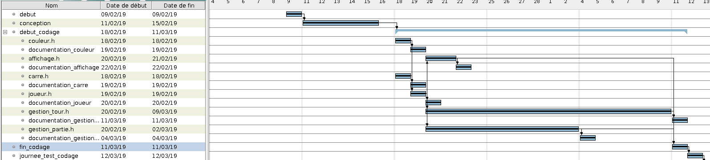
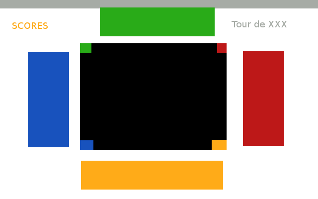
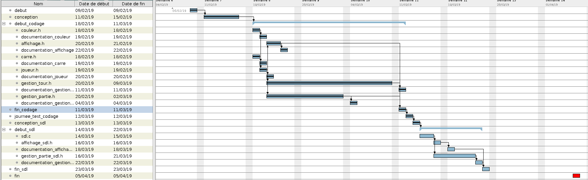
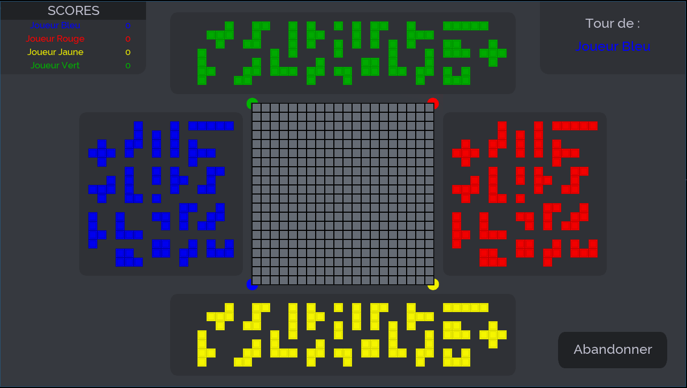
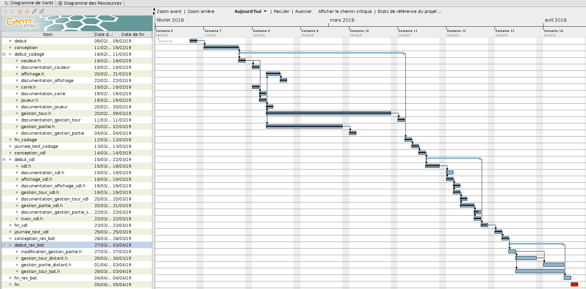

# Blokus_in_c

[Documentation du projet](https://lesys.github.io/Blokus_in_c/)

## Version 1 (console)

[Fichier conception V1 (console)](https://annuel.framapad.org/p/conduite-projet-l2info-zi-projet)

Implémentation V1:

- Diagramme de gantt

## Version 2 (sdl)

[Fichier conception V2 (ajout sdl)](https://annuel.framapad.org/p/conduite-projet-l2info-zi-projet-sdl)

Schémas de l'interface graphique:

- Tour jeu principal

- Diagramme de gantt

- Interface sous SDL

## Version 3 (réseau & bot)

[Fichier conception V3 (réseau & bot)](https://annuel.framapad.org/p/conduite-projet-l2info-zi-projet-bot-res)

Implémentation V3:

-Diagramme de gantt

